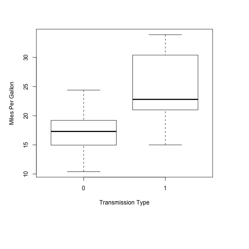

## Motivation

This report was intend to exploring the relationship between a set of variables and miles per gallon (MPG) using the mtcars data.  The data was extracted from the 1974 Motor Trend US magazine, and comprises fuel consumption and 10 aspects of automobile design and performance for 32 automobiles 

The data includes 11 variables as follows:
1) mpg: Miles/(US) gallon;
2) cyl: Number of cylinders;
3) disp: Displacement (cu.in.);
4) hp: Gross horsepower;
5) drat: Rear axle ratio;
6) wt: Weight (1000 lbs);
7) qsec: 1/4 mile time;
8) vs: V engine or a straight engine;
9) am: Transmission, automatic or manual;
10) gear: Number of forward gears;
11) carb: Number of carburetors.

--- .class #id 

## Single variable regression
We began with a simple regression model considering only transmission type as predictor. 

From the coefficients of the model, we could know that automatic cars are 17.15 MPG, while manual cars are 7.24 MPG more. This difference is significant (t(18.33)=-3.77, p=0.001). However, the r-square indicated that our model only explained 35.98% of the variance in MPG, suggested that there could be some other variables affect the MPG values.

```
##              Estimate Std. Error   t value     Pr(>|t|)
## (Intercept) 17.147368   1.124603 15.247492 1.133983e-15
## amManual     7.244939   1.764422  4.106127 2.850207e-04
```

--- .class #id

## Multivariable regression
Then we choose the multiple regression model using AIC in a stepwise algorithm. 


The best model consider cyl,hp, wt as cofunders with am, and it explained 84.97% of the variance in MPG. This model is better than the simple regression model (p<0.0001). And in this model, manual cars also get better MPG, about 2.94 higher than automatic ones.

```
## Analysis of Variance Table
## 
## Model 1: mpg ~ am
## Model 2: mpg ~ wt + qsec + am
##   Res.Df    RSS Df Sum of Sq      F   Pr(>F)    
## 1     30 720.90                                 
## 2     28 169.29  2    551.61 45.618 1.55e-09 ***
## ---
## Signif. codes:  0 '***' 0.001 '**' 0.01 '*' 0.05 '.' 0.1 ' ' 1
```

--- .class #id 

## Conclusion
Using both simple linear regression model and multiple regression model, we found that an manual transmission is better for MPG than automatic type, the average difference is about 7.2MPG in simple model, and 1.8MPG when considering number of cylinders, weight and gross horsepower as cofounders.

---
